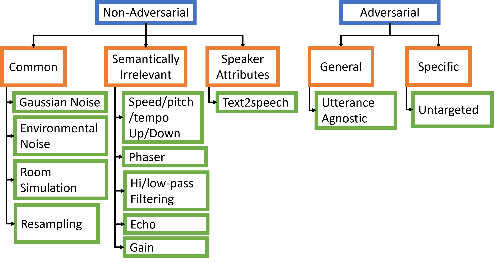

# Speech Robust Bench
This repository contains the code for the paper "Speech Robust Bench: A Robustness Benchmark For Speech Recognition". 
Speech Robust Bench (SRB), a comprehensive benchmark for evaluating the robustness of ASR models to diverse corruptions. SRB is composed of 69 input perturbations which are intended to simulate various corruptions that ASR models may encounter in the physical and digital world. The taxonomy of perturbations is illustrated in the figure below. 



All the perturbations, except Text2speech are applied at 4 levels of increasing severity. We have made perturbed versions of the Librispeech test-clean and the Multi-lingual Librispeech Spanish test set available on Huggingface hub [\[link\]](https://huggingface.co/datasets/mshah1/speech_robust_bench). The dataset is fully compatible with the Huggingface library and can easily be used to evaluate the robustness of ASR models.

## Installation
In our experiments we used `Python 3.10`, `PyTorch 2.2.0`, `transformers 4.34.0`.
```
conda create -n speech-robust-bench python=3.10
pip install TTS==0.22.0
pip install -r requirements.txt
cd robust_speech
pip install -e .
cd deepspeech.pytorch
pip install -e .
```

## Quick Start
The following code can be used to reproduce the results in the paper for English models. The process for the spanish models will be largely the same, and only the following cmdline args would need to be specified `--dataset facebook/multilingual_librispeech --subset spanish --split test` .

### Directory Setup
```
mkdir <root>/speech_robust_bench
cd <root>/speech_robust_bench
export SRB_ROOT=<root>/speech_robust_bench
```
Set `<root>` to a location which can store somewhat large files.

**Download Deepspeech Checkpoint**
```
mkdir $SRB_ROOT/deepspeech_ckps
cd $SRB_ROOT/deepspeech_ckps
wget https://github.com/SeanNaren/deepspeech.pytorch/releases/download/V3.0/librispeech_pretrained_v3.ckpt
```

### Evaluating Models on Non-Adversarial Perturbations
To evaluate the *utility* of the models we will run the following script
```
python run_speech_robust_bench.py
```
This script will call `evaluate_single.py` for each model in `en_models` (`run_speech_robust_bench.py` line 19), perturbation type and severity. `en_models` has been populated with all the models used in the paper. You may extend this list with other models from Huggingface hub. By default the results will be saved in `./outputs/{model_name}/{perturbation type}-{severity}.csv`. Run `python run_speech_robust_bench.py --help` for more information on the available options.

The same script can be used to also evaluate the stability of the models by adding the `--run_perturb_robustness_eval` flag. 
```
python run_speech_robust_bench.py --run_perturb_robustness_eval
```
This will evaluate the stability of the models by running the models on 500 randomly selected utterances perturbed with 30 samples of each perturbation at severity level 1. The results will be saved in `./outputs/{model_name}/{perturbation type}-1-pertEval_500_30.csv`.

### Evaluating Models on Adversarial Perturbations
**Step 1: Data Preparation**

We use [`robust_speech`](https://github.com/RaphaelOlivier/robust_speech/tree/main) to evaluate models against adversarial perturbations. `robust_speech` currently does not load datasets directly from Huggingface hub. You may use the `download_and_organize_hf_dataset.py` script to download and organize the datasets in the directory structure expected by `robust_bench`. The script will download the dataset from Huggingface hub and save it in the directory structure shown above. The script can be used as follows:
```
mkdir -p $SRB_ROOT/robust_speech_data_root/data/LibriSpeech/test-clean

python download_and_organize_hf_dataset.py --dataset=librispeech_asr --split=test.clean --output_dir=$SRB_ROOT/robust_speech_data_root/data/LibriSpeech/test-clean

python download_and_organize_hf_dataset.py --dataset=librispeech_asr --split=validation.clean --output_dir=$SRB_ROOT/robust_speech_data_root/data/LibriSpeech/dev-clean
```

**Step 2: Evaluate against Specific (PGD) Attacks**
```
python run_speech_robust_bench_adv.py --dataset LibriSpeech --data_root $SRB_ROOT/robust_speech_data_root --attack_type pgd
```
the results will be stored in `$SRB_ROOT/robust_speech_data_root/attacks/pgd/LibriSpeech`

**Step 3: Evaluate against Universal Adversarial Perturbations**
```
cd robust_speech/recipes
python \<root\>run_speech_robust_bench_adv.py --dataset LibriSpeech --data_root $SRB_ROOT/robust_speech_data_root --attack_type universal
```
the utterance agnostic perturbation will be stored in `$SRB_ROOT/robust_speech_data_root/attacks/universal/LibriSpeech/<model_name>/CKPT+<datetime>/delta.ckpt`

We can now use `run_speech_robust_bench_adv.py` to evaluate the models against the adversarial perturbations.
```
python run_speech_robust_bench.py --run_universal_adv_eval_only --universal_adv_delta_path $SRB_ROOT/robust_speech_data_root/attacks/universal/LibriSpeech
```

**Step 4: Collating The Results**
```
python collate_results.py
```
This script will collate the results from the non-adversarial and adversarial evaluations and save them in `./results`. Run `python collate_results.py --help` for more information on the available options.

This script will generate 3 csv files in the `./results` directory: 
- `collated_results_all_models.csv`: Containing the WER and CER for all the models evaluated on all the perturbations. Each row corresponds to the results for a single model and perturbation. The fields in the csv are:
`,model,dataset,augmentation,severity,WER,CER,WED,CED,nwords,nchars,runid,subset`, where WER and CER are the word and character error rates, WED and CED are the word and character errors, nwords and nchars are the number of words and characters in the dataset, and runid is the unique identifier for the run.
- `collated_PertRob_results.csv`: Contains the results for the model stability evaluation. Each row corresponds to the transcription results for a single utterance for a given model, under single sampling of the perturbation. The fields in the csv are: 
`,Unnamed: 0,id,reference,prediction,wer,cer,pert_idx,model,augmentation,severity,dataset`, where `id` is the unique identifier for the utterance, `reference` is the ground truth transcription, `prediction` is the model's transcription, `wer` and `cer` are the word and character error rates, `pert_idx` indicates different samplings of the same perturbation, and `model`, `augmentation`, `severity`, `dataset` are the model name, augmentation type, severity level and dataset name respectively.
- `full_result_df.csv`: Contains the utterance-wise results for all models and perturbations. The fieds in this csv are:
`id,reference,prediction,wer,cer,model,augmentation,severity,dataset,runid`.

**Step 5: Computing Metrics**
The following iPython notebooks can be used to replicate the results of the paper:
- `result_analysis_utility.py`: Code for computing NWER and plotting the results of utility-based (WER and NWER) based analyses from the paper.
- `result_analysis_stability.py`: Code for computing WERV and plotting the results of the stability-based analyses from the paper.
- `gender_analysis.ipynb`: Code for analyzing the disparity in robustness across genders.

<!-- ## Data
The evaluation code (introduced below) expects the datasets perturbed by _non-adversarial_ perturbations to be precomputed and uploaded to Huggingface hub. 

### Precomputed Datasets
We have made precomputed perturbed datasets for the test.clean subset of Librispeech and the Spanish test set of Multilingual LibriSpeech have been uploaded to Huggingface hub in `mshah1/speech_robust_bench`. The can be loaded with the following code:

```
from datasets import load_dataset

# loading perturbed Librispeech

dataset = load_dataset(mshah1/speech_robust_bench, f'librispeech_asr-test.clean', split=f'{aug}.{sev}')

# loading perturbed Spanish Multilingual Librispeech
dataset = load_dataset(mshah1/speech_robust_bench, f'multilingual_librispeech-spanish_test', split=f'{aug}.{sev}')
```
Here `aug` is the augmentation type and `sev` is the severity level. `aug` must be a key in `corruptions.AUGMENTATIONS` and `1<= sev <= len(corruptions.AUGMENTATIONS)`.

### Perturbing Your Own Dataset
You can perturb your own dataset using the `create_transformed_dataset.py` script. 

The following code creates a perturbed version of the test-clean subset of Librispeech with Gaussian noise of severity level 1 and uploads it to the `<user>/<repo_name>` repo on Huggingface hub.
```
python create_transformed_dataset.py --augmentation gnoise:1 --dataset=librispeech_asr --subset test-clean --srb_hf_repo <user>/<repo_name>
```
**Note: `--dataset` must be the name of a dataset on HF hub.**

The follow code creates the dataset for conducting stability analysis with Gaussian noise of level 1. This dataset contains 500 randomly selected utterances perturbed with 30 samples of Gaussian noise at SNR 10 dB.
```
python create_transformed_dataset.py --augmentation gnoise:1 --dataset=librispeech_asr --subset test-clean --srb_hf_repo <user>/<repo_name> --run_perturb_robustness_eval
```

## Running Speech Robust Bench Evaluation
### Evaluating a single model on a single Non-Adversarial perturbation
Use `evaluate_single.py` to evaluate a single model on a single perturbation.

**Example 1: English model precomputed perturbed Librispeech test-clean dataset**
```
# Evaluate wav2vec2-base-960h under Gaussian noise of severity level 1 on the SRB eval set computed with LibriSpeech test-clean

python evaluate_single.py --model_name=facebook/wav2vec2-base-960h --augmentation gnoise:1

# Run stability evaluation
python evaluate_single.py --model_name=facebook/wav2vec2-base-960h --augmentation gnoise:1 --run_perturb_robustness_eval
```
**Note on datasets**: If `--augmentation` is passed then `evaluate_single.py` expects the perturbed dataset to be precomputed and uploaded to Huggingface hub in the repo passed as `--srb_hf_repo`. The dataset is expected to have subsets and splits as follows:
```
subset = f'{args.subset}_{args.split}' if args.subset else args.split
dataset = load_dataset(args.srb_hf_repo, f'{args.dataset.split("/")[-1]}-{subset}', split=f'{aug}.{sev}')
```
Precomputed perturbed datasets for the test.clean subset of Librispeech and the Spanish test set of Multilingual LibriSpeech have been uploaded to Huggingface hub in `mshah1/speech_robust_bench`.

**Example 2: Multi-Lingual Model on Spanish Multi-Lingual Librispeech test**
```
# Evaluate whisper-large-v2 under Gaussian noise of severity level 1 on the SRB eval set computed with the Spanish test set of Multilingual LibriSpeech

python evaluate_single.py --model_name=openai/whisper-large-v2 --augmentation gnoise:1 --dataset=facebook/multilingual_librispeech --subset spanish --split test --language spanish
```
**Note on language and multi-lingual models:** `--language` is required when evaluating multi-lingual models on Non-English data. If incorrectly specified the models may produce incorrect transcripts. `--language` must be the full name of the language with the first letter in upper case, for example, English, Spanish, etc. _Currently the multi-lingual models supported by the codebase are the **Whisper family**, and **MMS**._ Adding support for more multi-lingual models should be straightforward, and can be done by adding the code for setting the language in the `evaluate_single.py` script.

Run `python evaluate_single.py --help` for more information on the available options.

### Evaluating multiple models on multiple Non-Adversarial perturbations
`run_speech_robust_bench.py` is a wrapper script that calls `evaluate_single.py` multiple times for each model, perturbation type and severity. It can be used to evaluate multiple models on multiple perturbations. To use it, specify the English models in `en_models` and the Spanish models in the `es_models` list, and run `run_speech_robust_bench.py` with the `--dataset`, `--subset` and `--split` appropriately specified. Run `python run_speech_robust_bench.py --help` for more information on the available options.

**Note on language and multi-lingual models:** `run_speech_robust_bench.py` automatically sets `--language` to English if `--dataset=lirbispeech_asr` and to Spanish otherwise. The script will need to be modified for other languages.

### Evaluating A Single Model Against Adversarial Perturbations
#### Setup
We use [`robust_speech`](https://github.com/RaphaelOlivier/robust_speech/tree/main) to evaluate models against adversarial perturbations. `robust_speech` currently does not load datasets directly from Huggingface hub. Therefore, the datasets must be downloaded and saved locally in the following directory structure:
```
<data_root>
├── <data>
│   ├── <dataset>
│   │   ├── <split>
│   │   │   ├── ...
│   │   │   ├── <file>.flac
│   │   │   ├── <file>.trans.txt
```
You may use the `download_and_organize_hf_dataset.py` script to download and organize the datasets. The script will download the dataset from Huggingface hub and save it in the directory structure shown above. The script can be used as follows:
```
python download_and_organize_hf_dataset.py --dataset=librispeech_asr --split=test.clean --output_dir=<data_root>/data/librispeech_asr/test-clean
```

# Compute Utterance Agnostic Adversarial Perturbation at SNR 10
cd robust_speech/recipes 
python fit_attacker.py attack_configs/LibriSpeech/universal/hf.yaml --root={args.data_root} --model_repo=facebook --model_name=wav2vec2-base-960h --snr=10 --dataset {args.dataset} --data_csv_name {args.data_csv_name} -->


