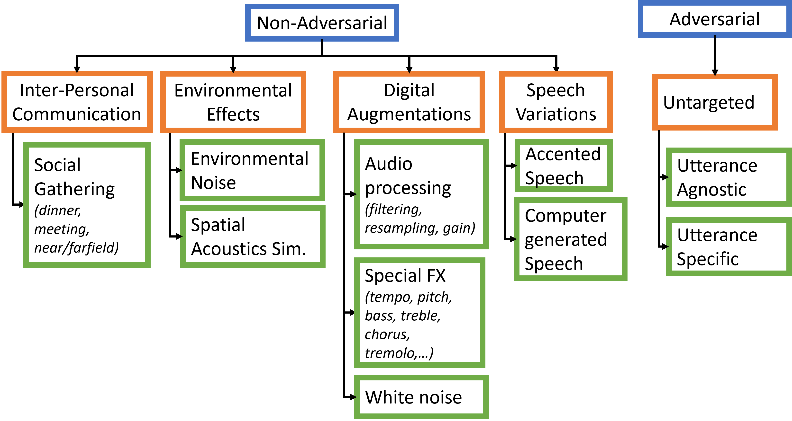

# Speech Robust Bench
This repository contains the code for the paper "Speech Robust Bench: A Robustness Benchmark For Speech Recognition" 
<!-- [\[arXiv\]](https://arxiv.org/abs/2403.07937).  -->
Speech Robust Bench (SRB), a comprehensive benchmark for evaluating the robustness of ASR models to diverse corruptions. SRB is composed of 114 input perturbations which are intended to simulate various corruptions that ASR models may encounter in the physical and digital world. The taxonomy of perturbations is illustrated in the figure below, and further details can be found in Section 3.2 and Appendix A of the paper (linked above). 



We have made perturbed versions of the Librispeech test-clean, Multi-lingual Librispeech Spanish test set and TEDLIUM release-3 test available on Huggingface hub [\[link\]](https://huggingface.co/datasets/mshah1/speech_robust_bench). The dataset is fully compatible with the Huggingface library and can easily be used to evaluate the robustness of ASR models. The dataset on HuggingFace contains only the non-adversarial pertubations because the adversarial perturbation are model specific. Instructions for computing adversarial perturbations for your own models are provided [below](#evaluating-models-on-adversarial-perturbations).

## Installation
In our experiments we used `Python 3.10`, `PyTorch 2.2.0`, `transformers 4.34.0`.
```
conda create -n speech-robust-bench python=3.10
git submodule update --init --recursive
[OPTIONAL -- not needed for eval] pip install TTS==0.22.0
pip install -r requirements.txt
cd robust_speech
pip install -e .
cd deepspeech.pytorch
pip install -e .
```

## Quick Start
The following code can be used to reproduce the results in the paper for English models. The process for the spanish models will be largely the same, and only the following cmdline args would need to be specified `--dataset facebook/multilingual_librispeech --subset spanish --split test` .

### Directory Setup
```
mkdir <root>/speech_robust_bench
cd <root>/speech_robust_bench
export SRB_ROOT=<root>/speech_robust_bench
```
Set `<root>` to a location which can store somewhat large files.

**Download Deepspeech Checkpoint**
```
mkdir $SRB_ROOT/deepspeech_ckps
cd $SRB_ROOT/deepspeech_ckps
wget https://github.com/SeanNaren/deepspeech.pytorch/releases/download/V3.0/librispeech_pretrained_v3.ckpt
```

### Evaluating Models on Non-Adversarial Perturbations
To evaluate the *utility* of the models we will run the following script
```
python run_speech_robust_bench.py
```
This script will call `evaluate_single.py` for each model in `en_models` (`run_speech_robust_bench.py` line 19), perturbation type and severity. `en_models` has been populated with all the models used in the paper. You may extend this list with other models from Huggingface hub. By default the results (file_id, reference transcript, predicted transcript, WER and CER) will be saved in `./outputs/{model_name}/{perturbation type}-{severity}.csv`. Run `python run_speech_robust_bench.py --help` for more information on the available options.

The same script can be used to also evaluate the stability of the models by adding the `--run_perturb_robustness_eval` flag. 
```
python run_speech_robust_bench.py --run_perturb_robustness_eval
```
This will evaluate the stability of the models by running the models on 500 randomly selected utterances perturbed with 30 samples of each perturbation at severity level 1. The results will be saved in `./outputs/{model_name}/{perturbation type}-1-pertEval_500_30.csv`.

### Evaluating Models on Adversarial Perturbations
**Step 1: Data Preparation**

We use [`robust_speech`](https://github.com/RaphaelOlivier/robust_speech/tree/main) to evaluate models against adversarial perturbations. `robust_speech` currently does not load datasets directly from Huggingface hub. You may use the `download_and_organize_hf_dataset.py` script to download and organize the datasets in the directory structure expected by `robust_bench`. The script will download the dataset from Huggingface hub and save it in the directory structure shown above. The script can be used as follows:
```
mkdir -p $SRB_ROOT/robust_speech_data_root/data/LibriSpeech/test-clean

python download_and_organize_hf_dataset.py --dataset=librispeech_asr --split=test.clean --output_dir=$SRB_ROOT/robust_speech_data_root/data/LibriSpeech/test-clean

python download_and_organize_hf_dataset.py --dataset=librispeech_asr --split=validation.clean --output_dir=$SRB_ROOT/robust_speech_data_root/data/LibriSpeech/dev-clean
```

**Step 2: Evaluate against Specific (PGD) Attacks**
```
python run_speech_robust_bench_adv.py --dataset LibriSpeech --data_root $SRB_ROOT/robust_speech_data_root --attack_type pgd
```
the results will be stored in `$SRB_ROOT/robust_speech_data_root/attacks/pgd/LibriSpeech`

**Step 3: Evaluate against Universal Adversarial Perturbations**

__Step 3.1: Compute the Perturbation__
```
cd robust_speech/recipes
python \<root\>run_speech_robust_bench_adv.py --dataset LibriSpeech --data_root $SRB_ROOT/robust_speech_data_root --attack_type universal
```
the utterance agnostic perturbation will be stored in `$SRB_ROOT/robust_speech_data_root/attacks/universal/LibriSpeech/<model_name>/CKPT+<datetime>/delta.ckpt`

__Step 3.2: Evaluate the Models__

We can now use `run_speech_robust_bench_adv.py` to evaluate the models against the adversarial perturbations.
```
python run_speech_robust_bench.py --run_universal_adv_eval_only --universal_adv_delta_path $SRB_ROOT/robust_speech_data_root/attacks/universal/LibriSpeech
```

**Step 4: Collating The Results**
```
python collate_results.py
```
This script will collate the results from the non-adversarial and adversarial evaluations and save them in `./results`. Run `python collate_results.py --help` for more information on the available options.

This script will generate 3 csv files in the `./results` directory: 
- `collated_results_all_models.csv`: Containing the WER and CER for all the models evaluated on all the perturbations. Each row corresponds to the results for a single model and perturbation. The fields in the csv are:
`,model,dataset,augmentation,severity,WER,CER,WED,CED,nwords,nchars,runid,subset`, where WER and CER are the word and character error rates, WED and CED are the word and character errors, nwords and nchars are the number of words and characters in the dataset, and runid is the unique identifier for the run.
- `collated_PertRob_results.csv`: Contains the results for the model stability evaluation. Each row corresponds to the transcription results for a single utterance for a given model, under single sampling of the perturbation. The fields in the csv are: 
`,Unnamed: 0,id,reference,prediction,wer,cer,pert_idx,model,augmentation,severity,dataset`, where `id` is the unique identifier for the utterance, `reference` is the ground truth transcription, `prediction` is the model's transcription, `wer` and `cer` are the word and character error rates, `pert_idx` indicates different samplings of the same perturbation, and `model`, `augmentation`, `severity`, `dataset` are the model name, augmentation type, severity level and dataset name respectively.
- `full_result_df.csv`: Contains the utterance-wise results for all models and perturbations. The fieds in this csv are:
`id,reference,prediction,wer,cer,model,augmentation,severity,dataset,runid`.

**Step 5: Computing Metrics**
The following iPython notebooks can be used to replicate the results of the paper:
- `result_analysis_utility.py`: Code for computing NWER and plotting the results of utility-based (WER and NWER) based analyses from the paper.
<!-- - `result_analysis_stability.py`: Code for computing WERV and plotting the results of the stability-based analyses from the paper. -->
- `gender_analysis.ipynb`: Code for analyzing the disparity in robustness across genders.

## Evaluating Your Model
To evaluate your custom model with the code in this repo perform the following steps.
### Evaluating on Non-Adversarial Perturbations
**Step 1: Define a Transcription Pipeline**

__Step 1.1: Create models/{model_name}.py__

In `models/{model_name}.py` define a the `create_model_pipeline` function with following minimal signature.
```
def create_model_pipeline(dataset, model, batch_size=1, gen_kwargs={}, **kwargs) -> Generator|Iterable:
    '''
    - Load model
    pipe:
      - iterate over dataset
          - pass audio to model
          - retrieve transcription
          - yield {'text': transcription}
    '''
    return pipe
```
`create_model_pipeline` should return an Iterable or a Generator that yields a dictionary such as `{'text': transcription}` for each audio in the dataset. The `transcription` should be the output of the model for the audio.

__Step 1.2: Add `create_model_pipeline` to `models/__init__.py`__

Add an `elif` with your model name and the `create_model_pipeline` function to `models/__init__.py`. For example,
```
elif model == 'rnnt':
    return rnnt.create_model_pipeline(dataset, batch_size=batch_size, **kwargs)
```

**Step 2: Evaluate the Model on Non-Adversarial Data**
Just add your model name to the list of models in `run_speech_robust_bench.py` and run the script as described in the [Quick Start](#quick-start) section.

### Evaluating on Adversarial Perturbations
The steps for evaluating your model on adversarial perturbations are slightly more involved since we will need to make it amenable for evaluation with the `robust_speech` library.

**Step 1: Create a config for your model**

Create a [HyperYAML](https://github.com/speechbrain/HyperPyYAML) config for your model in `robust_speech/recipes/model_configs`. Any fields you define here can be used in the `AdvASRBrain` subclass for your model. You may look at `robust_speech/recipes/model_configs/canary-1b.yaml` and the configs in `robust_speech/recipes/model_configs/hf/` for examples. 

*Note: The `placeholder_model` defined in all the configs is a requirement. It does not effect the output but is needed for things to work.*

**Step 2: Create an `AdvASRBrain` subclass for your model**

We have created a base subclass of `AdvASRBrain` called `BaseASR` in `robust_speech/models/base_robust_speech_model.py`. This subclass implements a lot of the boilerplate code needed for adversarial evaluation. You will need to subclass `BaseASR` and implement the unimplemented functions:
- `eval_forward`: Forward pass of the model during evaluation. Should return loss and transcripts.
- `train_attack_forward`: Forward pass of the model during adversarial attack generation or training. Should return loss and transcripts.
- `text_to_tokens`: Convert a transcription to a list of tokens.
- `wav_to_feats`: Convert a wav file to a feature tensor.

You can look at `robust_speech/models/canary.py` for an example implementation.

**Step 3: Create an Attack Config For Your Model**

Create an attack config for your model in `robust_speech/recipes/attack_configs`. You can look at `robust_speech/recipes/attack_configs/canary-1b.yaml` for an example. Most of the fields in the config are shared across models. The fields you may need to change are:
- `model_name`: The name of your model.
- `target_brain_class`: Module path to the `AdvASRBrain` subclass for your model.
- `target_brain_hparams_file`: Path to the HyperYAML config for your model.
- `source_model_name`: Usually the same as `model_name`.
- `source_brain_class`: Usually the same as `target_brain_class`.
- `source_brain_hparams_file`: Usually the same as `target_brain_hparams_file`.

You may change any paths you want to but the default paths should work out of the box

**Step 4: Run the Adversarial Evaluation**

You can now run the adversarial evaluation as described in the [Quick Start](#quick-start) section.

## Perturbing a Custom Dataset

You can perturb your own dataset using the `create_transformed_dataset.py` script. Currently the script pull the datasets from HuggingFace Hub but you can modify it to pull the datasets from any other source. The following code creates a perturbed version of the test-clean subset of Librispeech with Gaussian noise of severity level 1 and uploads it to the `<user>/<repo_name>` repo on Huggingface hub.
```
python create_transformed_dataset.py --augmentation gnoise:1 --dataset=librispeech_asr --split test.clean --srb_hf_repo <user>/<repo_name>
```

## Extending the Benchmark
### Adding Perturbations
More perturbations can be added to the benchmark by adding their implementation to `corruptions.py`. The perturbations should ideally subclass `torch.nn.Module` and the forward function should take the audio recording as a tensor and output the perturbed recording, again, as a tensor. Below is an example of a perturbation that adds white noise to the audio.
```
class GaussianNoise(torch.nn.Module):
    def __init__(self, snr) -> None:
        super().__init__()
        self.snr = snr
    
    def __repr__(self):
        return f"GaussianNoise({self.snr} dB)"
    
    def forward(self, x, *args, **kwargs):
        if not isinstance(x, torch.Tensor):
            x = torch.FloatTensor(x)
        rng = torch.Generator(x.device)
        d = torch.empty_like(x).normal_(0, 1, generator=rng)
        snr = torch.zeros(x.shape[:-1], device=x.device) + self.snr
        return F.add_noise(x, d, snr)
```

An entry for the perturbation should be added to the `AUGMENTATIONS_2_FN_SEV` dictionary in `corruptions.py`. The key should be a string that uniquely identifies the perturbation and the value should be a tuple of the perturbation class and a list of parameters corresponding to different severity levels. The parameter value will be passed as the first positional argument to the perturbation class. Below is an example of adding the GaussianNoise perturbation to the dictionary.
```
AUGMENTATIONS_2_FN_SEV['gnoise'] = (GaussianNoise, [40, 30, 20, 10, 0])
```
Note, that the parameter here is SNR in dB. The severity levels should be in increasing order of severity. The perturbation can then be used by passing the key to the `--augmentation` argument of the evaluation scripts (`evaluate_single.py` or `run_speech_robust_bench.py`).

### Adding Metrics
By default the evaluation scripts compute the Word Error Rate (WER) and Character Error Rate (CER) for the models, however, the scripts store the predicted and reference transcripts in the output files. One can use these transcripts to compute other metrics as needed.

### Adding Models
New model-specific integration code goes in `models/`, dispatched by model-name prefix in `models/__init__.py` (see `models/canary.py` / `models/parakeet.py` for examples of models needing custom, non-generic handling). Some newer models require a `transformers` version newer than this repo's pinned `requirements.txt` — see [`docs/new_asr_models_setup.md`](docs/new_asr_models_setup.md) for how `granite-speech`, `Qwen3-ASR`, and `cohere-transcribe` were integrated using a second, isolated virtualenv rather than upgrading the main one.

## Citation
If you use this code in your research, please cite the following paper:
```
@article{shah2024speech,
  title={Speech Robust Bench: A Robustness Benchmark For Speech Recognition},
  author={Shah, Muhammad A and Noguero, David Solans and Heikkila, Mikko A and Kourtellis, Nicolas},
  journal={arXiv preprint arXiv:2403.07937},
  year={2024}
}
```